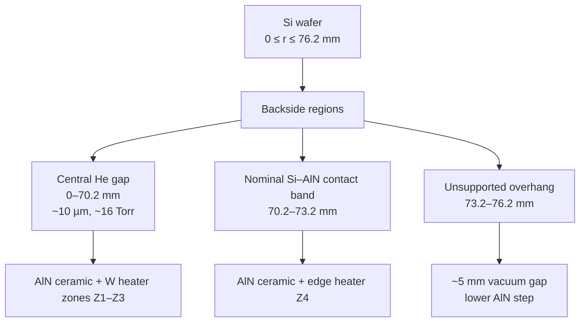
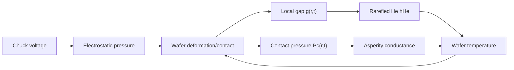
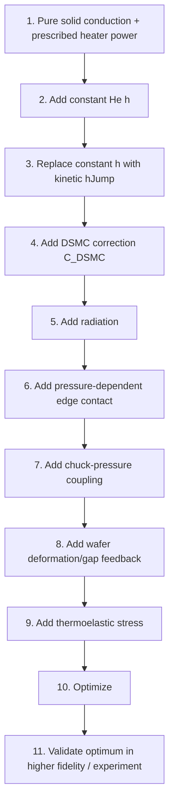
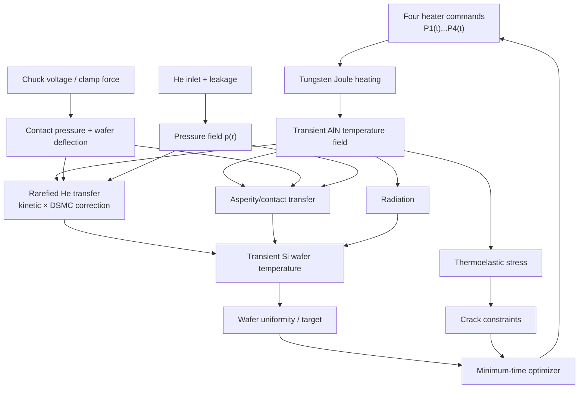

# Four-Zone AlN Electrostatic-Chuck / Wafer Thermal Optimization  
## Physical Problem Definition, Governing Physics, Mathematics, Assumptions, and Validation Plan

**Document version:** 1.0  
**Prepared:** 2026-09-04  
**Purpose:** This document defines the *physical problem*. It is intentionally independent of any specific numerical package. The same physics specification is to be solved by both the COMSOL implementation and the open-source MOOSE/PETSc implementation described in the companion implementation guide.

---

## 1. Why this document exists

The purpose of the project is to determine the **fastest safe transient heating strategy** for a four-zone tungsten heater embedded in an AlN ceramic electrostatic chuck (ESC), while maintaining wafer temperature uniformity and avoiding ceramic cracking.

The optimization is not simply:

> “Which heater zone should be turned on first?”

Instead, the physically correct problem is:

> Determine four independent time histories of heater actuation such that the wafer reaches a specified target temperature as quickly as possible, while all thermal, electrical, mechanical, contact, rarefied-gas, and material-safety limits are obeyed throughout the transient.

The desired outputs are therefore time functions such as

$$
P_1(t),\;P_2(t),\;P_3(t),\;P_4(t),
$$

or, if the power electronics are voltage controlled,

$$
V_1(t),\;V_2(t),\;V_3(t),\;V_4(t).
$$

The optimizer is allowed to discover automatically:

- which zone begins first;
- whether multiple zones should begin simultaneously;
- how quickly each zone should ramp;
- whether a zone should hold, taper, or reduce power;
- whether the outer zones should receive an early “lead”;
- when the final power should be reduced to avoid overshoot;
- the shortest feasible total warm-up time.

---

# 2. Current physical interpretation of the hardware

## 2.1 Geometry currently carried in the model

The current *working* axisymmetric geometry is:

| Quantity | Symbol | Working value | Status |
|---|---:|---:|---|
| Wafer diameter | $D_w$ | 152.4 mm (6 in) | working geometry from discussion |
| Wafer radius | $R_w$ | 76.2 mm | derived |
| Wafer thickness | $t_w$ | 675 $\mu$m | **assumption; must confirm** |
| Unsupported wafer overhang | $w_{oh}$ | 3.0 mm | user-specified |
| Outer radius of AlN support | $R_s$ | 73.2 mm | derived from 3 mm overhang |
| Nominal Si–AlN contact-band width | $w_c$ | 3.0 mm | user-specified |
| Inner radius of contact band | $R_c$ | 70.2 mm | derived |
| Central He-supported radius | $R_{He}$ | 70.2 mm | derived from current geometry |
| Nominal backside He gap | $g_0$ | 10 $\mu$m | user-specified |
| Backside He pressure | $p_{He}$ | 16 Torr | user-specified |
| Chamber pressure | $p_{ch}$ | about 1 mTorr | user-specified |
| He leakage/supply at steady state | $\dot V_{std}$ | about 1 sccm | user-specified approximate value |
| Lower ceramic step below overhang | $d_{step}$ | about 5 mm | user-specified approximate value |
| Ceramic material | — | AlN | user-specified |
| Heater material | — | tungsten | user-specified |
| Heater zones | — | 4 independently controllable radial zones | user-specified |
| Target temperature used in examples | $T_{tar}$ | 400 °C | working target from discussion |
| Initial temperature used in examples | $T_0$ | 25 °C | working assumption |

The first three heater zones have been *temporarily* represented as equal radial widths across the He-supported radius, giving:

$$
Z_1:0<r<23.4\text{ mm},
$$

$$
Z_2:23.4<r<46.8\text{ mm},
$$

$$
Z_3:46.8<r<70.2\text{ mm},
$$

and the edge zone as

$$
Z_4:70.2<r<73.2\text{ mm}.
$$

These zone boundaries are **not yet confirmed heater dimensions**. They are a clean working geometry for developing the optimization framework. Replace them with the real heater radii as soon as they are known.

### One unresolved geometric item

The He inlet was described as being “about 5 mm inside the wafer edge.” If that means 5 mm inward from $R_w=76.2$ mm, then

$$
R_{inlet}=71.2\text{ mm},
$$

which lies inside the current 70.2–73.2 mm nominal contact band. This could be physically correct if an annular supply groove sits within or adjacent to the seal/contact structure, but the exact reference needs confirmation. The model must therefore treat $R_{inlet}$ as a parameter until the drawing is checked.

---

## 2.2 Cross-sectional schematic



Fallback sketch for Markdown viewers that do not render Mermaid:

```text
CENTER                                                            EDGE
r = 0                                                              76.2 mm
|-----------------------------------------------------------------------|

                 SILICON WAFER
=========================================================================

      16 Torr He / 10 µm gap        nominal contact      3 mm overhang
|--------------------------------|-------------------|-------------------|
0                              70.2                73.2                76.2 mm
                                  Si↔AlN asperities          vacuum /
                                  + He microgaps             radiation
                                                            ↓ ~5 mm
                                                     lower ceramic step

                 AlN CERAMIC WITH W HEATERS
|------ Z1 ------|------ Z2 ------|------ Z3 ------|-- Z4 --|
```

---

# 3. Physical goal and optimization statement

The primary objective is **minimum time**:

$$
\boxed{\min t_f}
$$

where $t_f$ is the final time at which the wafer has genuinely reached the desired thermal state.

A valid final state must not merely pass through $T_{tar}$. It must satisfy all terminal requirements, for example

$$
\left|\overline{T}_w(t_f)-T_{tar}\right|\le \epsilon_T,
$$

$$
T_{w,\max}(t_f)-T_{w,\min}(t_f)\le \Delta T_{final},
$$

and

$$
\max_{\Omega_w}\left|\frac{\partial T_w}{\partial t}(t_f)\right|
\le \epsilon_{\dot T}.
$$

Here:

- $\overline{T}_w$ is the area-average wafer temperature;
- $T_{w,\max}$ is the maximum wafer temperature;
- $T_{w,\min}$ is the minimum wafer temperature;
- $\epsilon_T$ is the allowed mean-temperature error;
- $\Delta T_{final}$ is the final wafer nonuniformity limit;
- $\epsilon_{\dot T}$ prevents the optimizer from claiming success while the wafer is still rapidly heating.

The optimization must also obey path constraints at **all times**, not only at the final time.

---

# 4. Main heat-transfer paths

The wafer and chuck contain several simultaneous energy paths.

At a conceptual level,

$$
\dot Q_{total}
=
\dot Q_{W}
+\dot Q_{He}
+\dot Q_{contact}
+\dot Q_{rad}
+\dot Q_{support}
+\dot Q_{process}
+\cdots
$$

The heat-rate contributions are additive because energy conservation sums all fluxes. This does **not** mean the full temperature field can be obtained by superposition; that distinction is discussed later.

The dominant physics included in the reference model are:

1. transient conduction in AlN;
2. transient conduction in Si;
3. Joule heating in four tungsten heater zones;
4. rarefied He heat transfer in the central gap;
5. pressure variation caused by He supply and edge leakage;
6. rough-contact asperity conduction in the edge contact band;
7. He microgap conduction in regions that are nominally “contact” but not actually touching;
8. thermal radiation;
9. heat exchange through the bottom/support of the AlN ceramic;
10. electrostatic chuck force and contact pressure;
11. wafer deformation/bow when it changes the He gap or contact state;
12. thermoelastic stress in AlN/W and the resulting cracking constraints;
13. optional process-side heat input if plasma or another source is active.

---

# 5. Transient solid conduction

## 5.1 General heat equation

For each solid domain $m$ (Si, AlN, and W), the transient heat equation is

$$
\rho_m(T)c_{p,m}(T)\frac{\partial T}{\partial t}
=
\nabla\cdot\left[k_m(T)\nabla T\right]
+
q'''_m.
$$

### Symbols

| Symbol | Meaning | SI unit |
|---|---|---|
| $T$ | local absolute temperature | K |
| $t$ | physical time | s |
| $\rho_m$ | material density | kg m$^{-3}$ |
| $c_{p,m}$ | specific heat at constant pressure | J kg$^{-1}$ K$^{-1}$ |
| $k_m$ | thermal conductivity | W m$^{-1}$ K$^{-1}$ |
| $q'''_m$ | volumetric heat-generation rate | W m$^{-3}$ |
| $\nabla$ | spatial-gradient operator | m$^{-1}$ |

Because the problem spans approximately room temperature to 400 °C, temperature dependence of $k$, $c_p$, electrical resistivity, coefficient of thermal expansion, and elastic properties should be used wherever reliable data are available.

---

## 5.2 Axisymmetric form

For a 2-D axisymmetric global model with radial coordinate $r$ and vertical coordinate $z$,

$$
\rho c_p\frac{\partial T}{\partial t}
=
\frac{1}{r}\frac{\partial}{\partial r}
\left(
r k\frac{\partial T}{\partial r}
\right)
+
\frac{\partial}{\partial z}
\left(
k\frac{\partial T}{\partial z}
\right)
+
q'''.
$$

The factor

$$
\frac{1}{r}\frac{\partial}{\partial r}\left(r\,\cdot\right)
$$

is why radial transport is not equivalent to a flat Cartesian strip. The circumference available for radial heat flow grows with radius.

For a thin wafer, the cross-sectional area normal to radial heat flow at radius $r$ is

$$
A_r = 2\pi r t_w.
$$

The radial thermal resistance of an annulus from $r_1$ to $r_2$, when $k$ is approximately constant, is

$$
R_r
=
\frac{\ln(r_2/r_1)}
{2\pi k t_w}.
$$

This analytic equation is useful for sanity checks, while the full FEM model solves the PDE directly.

---

# 6. Tungsten heater physics

## 6.1 Electrical resistance

Each tungsten heater has a different resistance and may have different electrical limits:

$$
R_1(T)\neq R_2(T)\neq R_3(T)\neq R_4(T).
$$

A first engineering representation is

$$
R_i(T)
=
R_{i,0}
\left[
1+\alpha_{R,i}(T-T_0)
\right],
$$

where:

- $R_{i,0}$ is zone-$i$ resistance at reference temperature $T_0$;
- $\alpha_{R,i}$ is the measured effective temperature coefficient of resistance.

A measured table $R_i(T)$ is preferable to a single linear TCR if data are available over the full operating range.

## 6.2 Joule heating

For current control,

$$
P_i=I_i^2 R_i(T).
$$

For voltage control,

$$
P_i=\frac{V_i^2}{R_i(T)}.
$$

If the tungsten geometry is explicitly solved electromagnetically,

$$
\mathbf J = \sigma_e(T)\mathbf E,
$$

and

$$
q'''_J=\mathbf J\cdot\mathbf E,
$$

where $\mathbf J$ is current density, $\sigma_e$ is electrical conductivity, and $\mathbf E$ is electric field.

For the first global optimization, an equivalent zonal heat source based on measured $R_i(T)$ is usually sufficient and computationally cheaper. A local 3-D tungsten-track model should later verify local temperature and stress concentrations.

---

# 7. Rarefied helium heat transfer

## 7.1 Why ordinary gas conduction is inadequate

The key dimensionless parameter is the Knudsen number,

$$
\boxed{Kn=\frac{\lambda}{g}},
$$

where:

- $\lambda$ = molecular mean free path;
- $g$ = local wafer-to-chuck gap.

A useful viscosity-based estimate of mean free path is

$$
\lambda
\approx
\frac{\mu}{p}
\sqrt{\frac{\pi R_s T_g}{2}},
$$

where:

- $\mu$ is gas dynamic viscosity;
- $p$ is local absolute gas pressure;
- $R_s$ is the specific gas constant of He;
- $T_g$ is representative gas temperature.

For the nominal 16 Torr, 10 $\mu$m gap, the mean free path is of the same order as or larger than the gap. Around room temperature a first estimate gives $Kn$ of order unity; at several hundred °C it can be greater than unity. Therefore the gas is in the transition/free-molecular direction rather than a strict continuum-conduction regime.

This is why the model must not simply use

$$
h=\frac{k_{He}}{g}
$$

without rarefaction correction.

A 2015 ESC study specifically modeled rarefied heat transfer between wafer and chuck and verified an analytical model against DSMC; pressure and gas-surface accommodation were reported as especially influential parameters [R12].

---

## 7.2 Fast kinetic baseline

The production model uses a kinetic/temperature-jump baseline of the form

$$
\boxed{
h_{jump}
=
\frac{k_{He}(T_m)}
{g+\ell_{T,Si}+\ell_{T,AlN}}
}
$$

with

$$
T_m=\frac{T_{Si}+T_{AlN}}{2}.
$$

A commonly used engineering form for the temperature-jump length is

$$
\ell_T
=
\frac{2-\alpha}{\alpha}
C_T
\lambda,
$$

where:

- $\alpha$ = thermal accommodation coefficient of He at the wall;
- $C_T$ = kinetic-theory coefficient depending on gas model, $\gamma$, and $Pr$;
- $\lambda$ = mean free path.

One frequently used first-order form is

$$
C_T
\sim
\frac{2\gamma}{\gamma+1}\frac{1}{Pr}.
$$

This expression is a **baseline**, not a declaration that the surface physics are exactly known. Its role is to supply correct qualitative scaling with pressure, gap, temperature, and accommodation. It is then corrected by offline DSMC.

---

## 7.3 Balanced DSMC-corrected production model

The reference model uses

$$
\boxed{
h_{He}
=
h_{jump}\,C_{DSMC}
}
$$

where

$$
C_{DSMC}
=
\frac{h_{DSMC}}{h_{jump}}.
$$

Offline DSMC simulations are performed only for representative points in the operating envelope. The thermal optimizer never runs DSMC at each transient timestep.

The DSMC database samples:

$$
p,\quad g,\quad T_{AlN},\quad T_{Si},
\quad \alpha_{Si},\quad \alpha_{AlN}.
$$

A smooth analytic surrogate is fit to $C_{DSMC}$ using variables such as

$$
\ln Kn,\quad
T_m,\quad
\frac{\Delta T}{T_m},\quad
\operatorname{logit}(\alpha_{Si}),\quad
\operatorname{logit}(\alpha_{AlN}).
$$

This approach gives:

- kinetic behavior everywhere;
- DSMC correction where high-fidelity points have been run;
- smooth derivatives for gradient-based optimization;
- a safer fallback than a purely black-box interpolation outside the sampled region.

### Initial DSMC campaign

A practical first campaign is:

- 64 Latin-hypercube training cases;
- 16 nominal/anchor cases;
- 20 independent validation cases.

The initial surrogate-quality gate is approximately:

$$
\mathrm{RMS\ relative\ error}\le 5\%,
$$

$$
\mathrm{worst\ validation\ error}\le 10\%.
$$

Those are engineering starting criteria, not universal laws. If heater optimization is highly sensitive to $h_{He}$, tighter thresholds should be used.

---

## 7.4 DSMC numerical checks

SPARTA’s DSMC guidance notes traditional rules of thumb such as:

- timestep smaller than roughly one-quarter of mean collision time;
- cell size smaller than roughly one-third of mean free path;
- roughly 20 or more simulators per cell as an initial guideline;
- sufficient statistical averaging to reduce Monte Carlo noise [R20].

These are starting points. Every final DSMC table should include grid, timestep, particle-count, and sampling convergence checks.

For each local gap simulation,

$$
h_{DSMC}
=
\frac{\left|q''_{wall}\right|}
{\left|T_{AlN}-T_{Si}\right|}.
$$

The statistical standard error of $q''_{wall}$ should also be stored.

---

# 8. Helium pressure distribution and leakage

The steady-state gas supply approximately balances leakage:

$$
\dot m_{in}\approx \dot m_{leak}.
$$

The approximately 1 sccm gas flow should **not** be interpreted primarily as conventional forced-convection cooling. The important chain is

$$
\boxed{
\text{inlet + leak geometry}
\rightarrow
p(r,t)
\rightarrow
h_{He}(r,t).
}
$$

The central pressure may remain close to 16 Torr while most pressure drop occurs in the peripheral restriction. If the central gap itself contributes significant flow resistance, $p(r)$ may decline more gradually.

A practical hierarchical treatment is:

1. **First model:** $p=16$ Torr over the central region, with a parameterized edge roll-off.
2. **Intermediate model:** rarefied conductance network / two-dimensional pressure model.
3. **High-fidelity validation:** selected DSMC calculations near the inlet/seal geometry.

An AVS paper from Lam Research described a fast conductance-style alternative to full DSMC for ESC backside pressure distributions because the small-gap, low-pressure gas is transitional/molecular [R15].

---

# 9. Si–AlN contact band

Nominal contact does not mean full-area atomic contact. Real contact occurs at asperities.

The edge interface therefore contains parallel paths:

$$
\boxed{
q''_{edge}
=
q''_{asperity}
+
q''_{He,microgap}
+
q''_{rad,microgap}.
}
$$

An engineering contact conductance model can use a Cooper–Mikic–Yovanovich / Yovanovich-type form,

$$
h_{asp}
\approx
C
k_s
\frac{m}{\sigma}
\left(
\frac{P_c}{H_c}
\right)^n,
$$

where:

| Symbol | Meaning |
|---|---|
| $h_{asp}$ | solid asperity contact conductance |
| $C$ | empirical/correlation coefficient |
| $k_s$ | effective conductivity of the two solids |
| $m$ | effective mean asperity slope |
| $\sigma$ | combined RMS roughness |
| $P_c$ | nominal contact pressure |
| $H_c$ | effective microhardness |
| $n$ | pressure exponent, often near but below 1 |

A common effective conductivity definition is

$$
k_s=
\frac{2k_1k_2}{k_1+k_2}.
$$

Classical Yovanovich literature treats contact, gap, and joint conductance together and explicitly shows dependence on contact pressure, surface parameters, material conductivity, and interstitial gas [R9–R10].

Because the actual AlN surface finish, wafer backside condition, and chuck pressure are uncertain, $h_{contact}$ should eventually be calibrated using measured temperature data.

---

# 10. Chucking pressure and wafer deformation

## 10.1 Contact pressure

A first force-balance representation is

$$
P_{contact}
=
\max
\left[
0,\;
P_{chuck}
+
P_{preload}
-
(p_{He}-p_{top})
\right].
$$

Here:

- $P_{chuck}$ = electrostatic attractive pressure;
- $P_{preload}$ = any mechanical preload;
- $p_{He}-p_{top}$ = gas pressure tending to lift the wafer.

At 16 Torr,

$$
p_{He}\approx 2.13\text{ kPa}.
$$

This can be important when chuck pressure is only tens of kPa, and becomes relatively small if chuck pressure is hundreds of kPa or more.

## 10.2 Preferred chuck-pressure model

Three levels are possible.

### Level 1 — measured/calibrated relation

Use

$$
P_{chuck}=f(V_{chuck},T,r).
$$

This is the preferred first approach if clamp-force data or an internally validated ESC model exist.

### Level 2 — Coulomb electrostatic model

Solve electrostatics and compute Maxwell traction. In a simplified parallel-field picture,

$$
p_e\sim \frac{1}{2}\epsilon E^2,
$$

but the actual multilayer dielectric geometry should be solved rather than relying on this simplified form.

### Level 3 — Johnson–Rahbek chuck

For a Johnson–Rahbek ESC, clamp behavior depends on ceramic/interface electrical behavior and temperature. A simple parallel-plate formula is not sufficient. A measured or calibrated relation is preferred unless a validated JR electro-contact model is available.

COMSOL’s current ESC example explicitly couples electrostatic force, He pressure/flow, heat transfer, and solid mechanics, illustrating the importance of this multiphysics interaction [R14].

---

## 10.3 Gap deformation feedback

If chuck force or thermal bow changes the wafer-to-AlN separation,

$$
g=g(r,t).
$$

That produces a feedback loop:



The final arrow exists because temperature changes thermal strain and bow.

If measurements show that the gap shape is effectively fixed over the operating range, deformation can be disabled in the first optimization to reduce cost. It remains part of the high-fidelity reference model.

---

# 11. Thermal radiation

Radiation is explicitly included.

## 11.1 Basic relation

For two diffuse-gray surfaces in a simple effective-emissivity form,

$$
q''_{rad}
=
\epsilon_{eff}F\sigma_{SB}
\left(
T_1^4-T_2^4
\right),
$$

where:

- $\epsilon_{eff}$ = effective emissivity;
- $F$ = view factor;
- $\sigma_{SB}=5.670374419\times10^{-8}$ W m$^{-2}$ K$^{-4}$.

For large temperature differences, radiation is inherently nonlinear because of the $T^4$ dependence.

## 11.2 Required radiative paths

The model contains, as appropriate:

1. **Central He region:** AlN-to-Si radiation in parallel with rarefied He conduction.
2. **Contact/microgap region:** radiation across locally open microgaps.
3. **Overhang top surface:** radiation to upper chamber/process structures.
4. **Overhang underside:** radiation to the lower AlN step.
5. **Wafer cylindrical sidewall:** radiation to chamber structures.
6. **Exposed ceramic surfaces:** radiation to chamber/shields when thermally important.

For the 10 $\mu$m He gap, radiation is usually much weaker than He conduction at 16 Torr, but it is retained so that no heat path is silently omitted.

---

# 12. Unsupported overhang and inward penetration of edge cooling

The 3 mm overhang receives no direct high-pressure He coupling and no nominal solid contact. It obtains energy primarily through radial Si conduction and radiation from the lower step.

The overhang therefore acts approximately like a short annular thermal fin attached to the supported wafer edge.

A useful thin-plate “healing length” is

$$
L_H
=
\sqrt{\frac{k_w t_w}{h_v}},
$$

where:

- $k_w$ = wafer thermal conductivity;
- $t_w$ = wafer thickness;
- $h_v$ = local effective vertical heat-transfer coefficient.

The edge temperature disturbance approximately decays over this characteristic length. This is why a cold region can extend *inside* the geometric overhang boundary.

The full FEM model does not need this approximation, but the relation is valuable for interpretation and sanity checking.

---

# 13. AlN support / base boundary condition

The AlN ceramic must not be treated as thermally floating unless the actual system is floating.

The lower/support path may be represented by:

- explicit solid conduction into a base;
- a contact thermal resistance;
- a controlled base temperature;
- coolant channels;
- a calibrated equivalent heat-transfer coefficient.

A generic boundary representation is

$$
q''_{base}
=
h_{base}
\left(
T_{AlN}-T_{base}
\right).
$$

This path may strongly influence both total warm-up time and zone-to-zone coupling.

---

# 14. Optional top-side process load

If the warm-up optimization occurs before plasma or process heat is applied,

$$
q''_{process}=0.
$$

If process heat is active, include

$$
q''_{process}(r,t)
$$

as a separate wafer-top boundary heat flux.

Do not hide process heat by artificially modifying heater power or chamber temperature; keeping it explicit makes the model identifiable and reusable.

---

# 15. Thermoelastic stress and cracking

## 15.1 Why $dT/dt$ alone is insufficient

A practical hardware rule may say:

> “Do not heat the ceramic faster than $X$ K/s.”

That rule should be retained as a hard constraint, but ceramic cracking is fundamentally associated with stress generated by nonuniform thermal strain.

The actual chain is:

$$
\text{heater power}
\rightarrow
T(\mathbf x,t)
\rightarrow
\nabla T
\rightarrow
\epsilon_{th}
\rightarrow
\sigma
\rightarrow
\text{fracture risk}.
$$

## 15.2 Mechanical equilibrium

For quasi-static mechanics,

$$
\nabla\cdot\boldsymbol{\sigma}
+\mathbf b
=0,
$$

where $\boldsymbol{\sigma}$ is the Cauchy stress tensor and $\mathbf b$ is body force per volume.

Thermal strain for an isotropic material is

$$
\boldsymbol{\epsilon}_{th}
=
\alpha_{CTE}(T)
(T-T_{ref})\mathbf I.
$$

For linear thermoelasticity,

$$
\boldsymbol{\sigma}
=
\mathbf C:
\left(
\boldsymbol{\epsilon}
-
\boldsymbol{\epsilon}_{th}
\right).
$$

### Key monitored quantity

Because brittle ceramics are especially sensitive to tension, a useful deterministic screening constraint is

$$
\boxed{
\sigma_{1,\max}(t)
\le
\frac{\sigma_{allow}(T)}{SF},
}
$$

where:

- $\sigma_{1,\max}$ = maximum principal tensile stress in AlN;
- $\sigma_{allow}$ = selected allowable strength;
- $SF$ = safety factor.

Local 3-D verification around actual tungsten tracks is recommended because a 2-D axisymmetric annular-heater approximation can smooth local stress concentrations.

## 15.3 Practical safety constraints

The optimization should include:

$$
\max_{\Omega_{AlN}}
\left|
\frac{\partial T}{\partial t}
\right|
\le \beta_{max},
$$

$$
\max_{\Omega_{AlN}}
\sigma_1
\le
\frac{\sigma_{allow}}{SF},
$$

and optionally

$$
\max_{\Omega_{AlN}}
|\nabla T|
\le G_{max}.
$$

The measured safe heating-rate limit $\beta_{max}$ is especially important because it incorporates empirical failure experience not fully captured by an ideal deterministic material model.

---

# 16. Superposition and linearity

## 16.1 What superposition means

For a linear system, if heater 1 alone produces temperature rise $\Delta T_1$ and heater 2 alone produces $\Delta T_2$, then the combined response is

$$
\Delta T_{1+2}
=
\Delta T_1+\Delta T_2.
$$

This is the principle of superposition.

## 16.2 Why the full model is not linear

The full ESC model contains multiple nonlinearities:

- $k(T)$ and $c_p(T)$;
- tungsten $R(T)$;
- radiation $\propto T^4$;
- $h_{He}(p,T,g,\alpha)$;
- contact conductance $h_c(P_c,T,\ldots)$;
- chuck pressure and deformation;
- changing contact/open-gap state.

Therefore,

$$
\boxed{
T(P_1+P_2)\neq T(P_1)+T(P_2)
}
$$

in general.

## 16.3 What *is* additive

At a fixed state, heat-flow contributions satisfy the energy balance

$$
q''_{total}
=
q''_{He}
+
q''_{contact}
+
q''_{rad}
+\cdots.
$$

Additivity of heat rates is not the same as linear superposition of the final temperature solution.

## 16.4 Why a linearized model is still useful

Near a fixed operating point, such as a wafer already close to 400 °C, small perturbations can be linearized:

$$
\delta\dot{\mathbf x}
=
\mathbf A\delta\mathbf x
+
\mathbf B\delta\mathbf u.
$$

Then local superposition is approximately valid. This is useful for:

- heater influence matrices;
- linear MPC;
- PID decoupling;
- small steady-state uniformity corrections.

Use the nonlinear model for the full 25 °C $\rightarrow$ 400 °C warm-up and a linearized model only for small perturbations around a fixed state.

---

# 17. Complete optimization problem

Let the actuator vector be

$$
\mathbf u(t)
=
[P_1(t),P_2(t),P_3(t),P_4(t)]^T,
$$

or the hardware-native voltage/current equivalent.

A practical mathematical statement is

$$
\boxed{
\begin{aligned}
\min_{\mathbf u(t),\,t_f}\quad
& t_f
+\lambda_u
\sum_{i=1}^{4}
\int_0^{t_f}
\left(\dot P_i\right)^2dt
+\lambda_T
\int_0^{t_f}
\Delta T_w(t)^2dt
\\[3pt]
\text{subject to}\quad
& \text{thermal PDEs in Si, AlN, and W},\\
& \text{rarefied-He interface model},\\
& \text{contact/gap heat-transfer model},\\
& \text{radiation model},\\
& \text{thermoelastic equilibrium},\\
& 0\le P_i(t)\le P_{i,\max},\\
& V_i(t)\le V_{i,\max},\\
& I_i(t)\le I_{i,\max},\\
& |\dot P_i(t)|\le S_{P,i},\\
& |\dot T_{AlN}|\le \beta_{max},\\
& \sigma_{1,AlN}\le\sigma_{allow}/SF,\\
& \Delta T_w(t)\le\Delta T_{ramp,max}\quad\text{if required},\\
& |\overline T_w(t_f)-T_{tar}|\le\epsilon_T,\\
& \Delta T_w(t_f)\le\Delta T_{final},\\
& \max |\dot T_w(t_f)|\le\epsilon_{\dot T}.
\end{aligned}
}
$$

where

$$
\Delta T_w(t)=T_{w,\max}(t)-T_{w,\min}(t).
$$

The regularization weights $\lambda_u$ and $\lambda_T$ should be small enough that the primary objective remains minimum time.

---

# 18. Recommended control parameterization

Do not optimize discrete heater order directly.

Instead define each heater command as a continuous function represented by $N$ control points or polynomial segments:

$$
P_i(t)
\approx
\mathcal I
\left(
P_{i,1},P_{i,2},\ldots,P_{i,N}
\right),
$$

where $\mathcal I$ is an interpolation or control-function representation.

The decision variables become

$$
\mathbf z
=
[
t_f,
P_{1,1},\ldots,P_{1,N},
P_{2,1},\ldots,
P_{4,N}
].
$$

If $N=12$, there are

$$
4(12)+1=49
$$

primary decision variables.

This formulation automatically permits:

- delayed start;
- overlapping zones;
- zone-specific slew;
- holds;
- tapering;
- early edge preheating.

---

# 19. Data required before the optimization is physically authoritative

## 19.1 Geometry

- [ ] exact AlN radius and total thickness;
- [ ] exact top-surface features;
- [ ] exact W heater depth from the top surface;
- [ ] actual heater-zone radii;
- [ ] W track width and thickness, or equivalent heater volume;
- [ ] exact He inlet radius and groove dimensions;
- [ ] exact lower-step geometry;
- [ ] actual wafer thickness;
- [ ] mounting/support geometry.

## 19.2 Electrical data

- [ ] $R_i$ at room temperature;
- [ ] measured $R_i(T)$ or TCR for each zone;
- [ ] $V_{i,\max}$;
- [ ] $I_{i,\max}$;
- [ ] $P_{i,\max}$;
- [ ] electrical power-command or voltage/current slew limits;
- [ ] whether PWM, voltage, current, or power is the actual controller output.

## 19.3 AlN/W material data

- [ ] exact AlN grade/composition;
- [ ] $k(T)$;
- [ ] $c_p(T)$;
- [ ] $\rho$;
- [ ] CTE $\alpha(T)$;
- [ ] Young’s modulus $E(T)$;
- [ ] Poisson ratio $\nu(T)$;
- [ ] tensile/flexural strength or fracture data;
- [ ] tungsten temperature-dependent resistivity and CTE.

## 19.4 Interface data

- [ ] wafer backside roughness;
- [ ] AlN top-surface roughness;
- [ ] effective asperity slope if available;
- [ ] chuck force / pressure versus voltage and temperature;
- [ ] chuck type: Coulomb, Johnson–Rahbek, or empirical/calibrated;
- [ ] He accommodation information if available;
- [ ] emissivities / coatings.

## 19.5 Safety and control limits

- [ ] measured maximum safe ceramic heating rate;
- [ ] any known crack locations/failure histories;
- [ ] maximum allowed transient wafer nonuniformity;
- [ ] final wafer-uniformity requirement;
- [ ] target temperature and acceptable settling tolerance.

---

# 20. Validation ladder

Do not enable all complex physics at once.



At each step verify:

1. energy conservation;
2. mesh convergence;
3. timestep convergence;
4. expected limiting behavior;
5. comparison with hand calculations;
6. comparison with measured temperatures when available.

---

# 21. Suggested experimental calibration tests

A highly useful test campaign is:

### Test A — heater-zone step response

Apply a small safe power step to each heater independently and measure temperatures at multiple radial positions.

This identifies the dynamic influence matrix

$$
G_{ij}(t)
=
\frac{\Delta T_i(t)}
{\Delta P_j}.
$$

### Test B — He-pressure sweep

Repeat at several backside pressures. This constrains $h_{He}(p)$ and accommodation.

### Test C — chuck-voltage sweep

Repeat at several chuck voltages. This helps separate gas conductance from asperity-contact conductance.

### Test D — leak / pressure correlation

Measure steady He flow at fixed regulated pressure. Correlate leak changes with edge temperature behavior.

### Test E — safe ramp / crack-history data

Use historical limits or controlled qualification data to define $\beta_{max}$ and stress safety margins.

---

# 22. Key notation

| Symbol | Meaning | Unit |
|---|---|---|
| $r$ | radial coordinate | m |
| $z$ | vertical coordinate | m |
| $t$ | physical time | s |
| $t_f$ | final warm-up time | s |
| $T$ | temperature | K |
| $T_{tar}$ | target wafer temperature | K |
| $T_m$ | mean gas-wall temperature | K |
| $\rho$ | density | kg m$^{-3}$ |
| $c_p$ | specific heat | J kg$^{-1}$ K$^{-1}$ |
| $k$ | thermal conductivity | W m$^{-1}$ K$^{-1}$ |
| $q'''$ | volumetric heat generation | W m$^{-3}$ |
| $q''$ | heat flux | W m$^{-2}$ |
| $P_i$ | heater-zone electrical power | W |
| $V_i$ | heater-zone voltage | V |
| $I_i$ | heater-zone current | A |
| $R_i$ | heater-zone resistance | $\Omega$ |
| $g$ | local He gap | m |
| $p_{He}$ | local He pressure | Pa or Torr |
| $\lambda$ | molecular mean free path | m |
| $Kn$ | Knudsen number $\lambda/g$ | — |
| $\alpha$ | gas-surface thermal accommodation coefficient | — |
| $h_{He}$ | rarefied He heat-transfer coefficient | W m$^{-2}$ K$^{-1}$ |
| $h_{asp}$ | asperity thermal contact conductance | W m$^{-2}$ K$^{-1}$ |
| $P_c$ | mechanical contact pressure | Pa |
| $\sigma$ | RMS roughness in contact model (context dependent) | m |
| $m$ | mean asperity slope | — |
| $H_c$ | effective microhardness | Pa |
| $\epsilon$ | emissivity | — |
| $F$ | radiation view factor | — |
| $\sigma_{SB}$ | Stefan–Boltzmann constant | W m$^{-2}$ K$^{-4}$ |
| $\boldsymbol{\sigma}$ | mechanical stress tensor | Pa |
| $\sigma_1$ | maximum principal tensile stress | Pa |
| $\alpha_{CTE}$ | coefficient of thermal expansion | K$^{-1}$ |
| $SF$ | safety factor | — |
| $\beta_{max}$ | allowed ceramic heating rate | K s$^{-1}$ |
| $\Delta T_w$ | wafer max–min temperature spread | K |

---

# 23. References

The references below are both foundational and implementation-relevant.

**[R1]** K. A. Olson, D. E. Kotecki, A. J. Ricci, S. E. Lassig, and A. Husain, “Characterization, modeling, and design of an electrostatic chuck with improved wafer temperature uniformity,” *Review of Scientific Instruments*, 1995. IBM Research record:  
https://research.ibm.com/publications/characterization-modeling-and-design-of-an-electrostatic-chuck-with-improved-wafer-temperature-uniformity

**[R2]** G. A. Bird, *Molecular Gas Dynamics and the Direct Simulation of Gas Flows*, Oxford University Press, 1994. DOI:  
https://doi.org/10.1093/oso/9780198561958.001.0001

**[R3]** SPARTA, Sandia National Laboratories, open-source DSMC simulator:  
https://sparta.github.io/

**[R4]** SPARTA surface-collision documentation, including diffuse and CLL models:  
https://sparta.github.io/doc/surf_collide.html

**[R5]** SPARTA computational-efficiency / DSMC numerical-error guidance:  
https://sparta.github.io/pdf/sparta_2023_improve_comp_efficiency.pdf

**[R6]** SPARTA mean-free-path and mean-collision-time computation:  
https://sparta.github.io/doc/compute_lambda_grid.html

**[R7]** M. M. Yovanovich, “New Contact and Gap Conductance Correlations for Conforming Rough Surfaces,” AIAA Paper 81-1164, 1981:  
https://uwaterloo.ca/microelectronics-heat-transfer-laboratory/references/new-contact-and-gap-conductance-correlations-conforming

**[R8]** M. M. Yovanovich, “Thermal Contact Correlations,” 1982:  
https://www.mhtlab.uwaterloo.ca/old/paperlib/papers/contact/review/abstract2.html

**[R9]** M. M. Yovanovich and A. Hegazy, “An Accurate Universal Contact Conductance Correlation for Conforming Rough Surfaces with Different Micro-Hardness Profiles,” AIAA 83-1434, 1983:  
https://www.mhtlab.uwaterloo.ca/old/paperlib/papers/contact/general/abstract4.html

**[R10]** S. Song, M. M. Yovanovich, and F. O. Goodman, “Thermal Gap Conductance of Conforming Surfaces in Contact,” *Journal of Heat Transfer* 115, 1993, DOI 10.1115/1.2910719.

**[R11]** NIST Structural Ceramics Database, AlN thermal-conductivity data:  
https://srdata.nist.gov/CeramicDataPortal/Scd/Z00294

**[R12]** Y. Sun et al., “Factors influencing rarefied gas heat transfer between a wafer and an electrostatic chuck,” *Journal of Tsinghua University (Science and Technology)* 55(7), 2015:  
https://jst.tsinghuajournals.com/EN/Y2015/V55/I7/756

**[R13]** COMSOL 6.4 Electrostatic Chuck application example:  
https://doc.comsol.com/6.4/doc/com.comsol.help.models.mems.electrostatic_chuck/electrostatic_chuck.html

**[R14]** COMSOL 6.4 Heat Transfer and surface-to-surface radiation documentation:  
https://doc.comsol.com/6.4/doc/com.comsol.help.heat/heat_ug_interfaces.08.04.html

**[R15]** J. McInerney, “A Fast Numerical Method for Determining the Pressure Distribution in Electrostatic Chucks,” AVS 61st International Symposium, 2014:  
https://www2.avs.org/symposium2014/Papers/Paper_VT-TuM1.html

---

# 24. Final physical-model summary

The reference model should be thought of as the following coupled system:



The model is **nonlinear**, **transient**, **multiphysics**, and **constrained**. The goal is not to force a preselected heater order. The goal is to let the optimizer discover the fastest safe trajectory while the physics determine how each zone influences the wafer.

