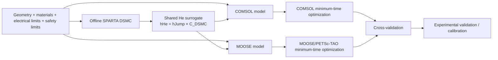

# Four-Zone AlN ESC Heater Optimization  
## Complete Implementation Manual for COMSOL + Python/MPh and Open-Source MOOSE/PETSc + SPARTA

**Document version:** 1.0  
**Prepared:** 2026-09-04  
**Companion document:** `ESC_HEATER_OPTIMIZATION_PROBLEM_SETUP.md`

This document explains **how to build, run, optimize, validate, and maintain two independent implementations of the same physical model**:

1. **Model A — COMSOL Multiphysics + Optimization Module + Python/MPh + offline SPARTA DSMC**
2. **Model B — MOOSE + PETSc/TAO + SPARTA DSMC + Gmsh + ParaView**

The two implementations should consume the **same material data, geometry, He surrogate, contact laws, actuator limits, and safety constraints**. Differences between them should be numerical/software differences, not different physics.

---

# 1. Overall software architecture



The recommended workflow is:

1. create a physically correct **forward model**;
2. validate the forward model;
3. create the offline DSMC correction;
4. calibrate uncertain interface parameters;
5. enable thermo-mechanical stress;
6. define optimization variables and constraints;
7. run minimum-time optimization;
8. validate the optimum in the second solver and, eventually, hardware.

Do **not** begin with the optimizer before the forward model is credible.

---

# 2. Model A — COMSOL path

## 2.1 Recommended COMSOL products

The minimum practical product set depends on how much physics is solved explicitly.

### Required for the recommended implementation

- **COMSOL Multiphysics 6.4**
- **Heat Transfer Module**
- **Structural Mechanics Module**
- **Optimization Module**

### Optional depending on modeling choice

- **AC/DC Module or MEMS Module** — useful if solving electrical current distribution / electrostatics / Maxwell stress explicitly.
- If you instead use measured $R_i(T)$ and a calibrated $P_{chuck}(V,T)$ relationship, the first optimization can avoid explicit electromagnetic physics.

COMSOL 6.4 Update 3 is the current 6.4 update at the time this document was prepared. COMSOL 6.4 supports Windows 10/11, current supported Linux distributions, and macOS versions listed in its system requirements [C1].

### Hardware

COMSOL’s published minimum is modest, but this model is more demanding than the minimum. A practical workstation target is:

- 8+ CPU cores;
- 32 GB RAM minimum for comfortable 2-D multiphysics optimization;
- 64 GB or more preferred if storing many transient states/sensitivities;
- SSD storage;
- more cores/RAM if moving to 3-D local stress models.

---

## 2.2 Verify your COMSOL modules

In the COMSOL GUI, check the licensed products before building the model. The exact menu wording can vary by installation, but use COMSOL’s license/product information to verify that **Heat Transfer**, **Structural Mechanics**, and **Optimization** are available.

If the Optimization Module is missing, you can still run the forward physics and automate parameterized sweeps from Python, but you cannot follow the preferred native adjoint minimum-time workflow.

---

# 3. Python environment for COMSOL automation

## 3.1 Use a normal 64-bit Python installation

MPh 1.4.0 requires Python 3.10 or newer [C2]. On Windows, its documentation specifically warns that the Microsoft Store Python can cause problems and recommends the standard Python installer if issues occur [C3].

A safe choice is Python 3.12 or 3.13, 64-bit.

### Windows PowerShell example

```powershell
mkdir C:\esc_optimization
cd C:\esc_optimization

py -3.12 -m venv .venv
.\.venv\Scripts\Activate.ps1

python -m pip install --upgrade pip
pip install MPh numpy scipy pandas matplotlib
```

### Linux/macOS example

```bash
mkdir -p ~/esc_optimization
cd ~/esc_optimization

python3 -m venv .venv
source .venv/bin/activate

python -m pip install --upgrade pip
pip install MPh numpy scipy pandas matplotlib
```

As of 2026-08-30, PyPI lists **MPh 1.4.0** as the current release and Python >=3.10 as the requirement [C2].

---

## 3.2 MPh compatibility warning

MPh 1.4.0 documentation says COMSOL **6.0 and newer are expected to work**, while successful testing is reported through **6.3** [C3].

Therefore COMSOL 6.4 should be treated as:

> expected to work, but first verify it with a smoke test.

Run:

```python
import mph

client = mph.start()
print(client)
```

Then test loading a tiny known `.mph` model:

```python
model = client.load("test_model.mph")
model.solve()
print("COMSOL solve completed")
```

If this works, the Python bridge is usable.

No separate Java installation is normally required because COMSOL ships its own Java runtime [C3].

---

# 4. COMSOL project folder layout

Use a reproducible structure such as:

```text
esc_comsol/
├── models/
│   ├── esc_forward_v001.mph
│   ├── esc_optimization_v001.mph
│   └── validation/
├── data/
│   ├── materials/
│   │   ├── aln_properties.csv
│   │   ├── silicon_properties.csv
│   │   └── tungsten_properties.csv
│   ├── electrical/
│   │   └── heater_resistance_vs_temperature.csv
│   ├── contact/
│   │   └── contact_parameters.yaml
│   └── helium/
│       ├── dsmc_cases.csv
│       └── he_dsmc_correction_model.json
├── python/
│   ├── smoke_test_mph.py
│   ├── run_forward.py
│   ├── batch_validate.py
│   └── update_he_surrogate.py
├── results/
│   ├── forward/
│   ├── optimization/
│   └── validation/
└── README.md
```

Use versioned filenames rather than repeatedly overwriting the only working model.

---

# 5. Build the COMSOL model: step-by-step

## 5.1 Choose dimensionality

Start with **2-D Axisymmetric**.

Why:

- heater zones are radial;
- wafer/chuck geometry is approximately rotationally symmetric;
- 2-D axisymmetry resolves radial and through-thickness gradients;
- it is far cheaper than full 3-D for repeated optimization.

Use a separate local 3-D submodel later for actual tungsten-track stress concentration or non-axisymmetric He inlets.

---

## 5.2 Global parameters

Create `Global Definitions > Parameters` and define parameters using explicit SI units.

Suggested names:

```text
Rw          = 76.2[mm]
tw          = 675[um]
Rsupport    = 73.2[mm]
Rcontact    = 70.2[mm]
g0          = 10[um]
Phe_set     = 16[Torr]
Pchamber    = 1[mTorr]
Rinlet      = 71.2[mm]     // placeholder; verify
step_gap    = 5[mm]

T0          = 25[degC]
Ttarget     = 400[degC]

rZ1         = 23.4[mm]
rZ2         = 46.8[mm]
rZ3         = 70.2[mm]
rZ4         = 73.2[mm]
```

Also define real dimensions:

```text
tAlN
zHeater
tW
```

only after the hardware values are known.

Do not put uncertain guesses into the final model without a comment such as `ASSUMED`.

---

# 6. COMSOL geometry

Create domains for:

1. AlN ceramic;
2. tungsten heater zones or equivalent heater annuli;
3. silicon wafer.

Do **not** necessarily create a meshed 10 $\mu$m He solid/fluid domain in the production model. The recommended model treats He as an interface heat-flux law because the gas is rarefied.

Create the wafer so that:

- 0–70.2 mm lies above the He-supported area;
- 70.2–73.2 mm is the nominal contact band;
- 73.2–76.2 mm is unsupported overhang.

Create the lower AlN step below the overhang if it is part of the same thermal ceramic body.

---

# 7. COMSOL named selections

Before adding physics, create stable **named selections**.

Suggested names:

```text
sel_wafer
sel_wafer_he
sel_wafer_contact
sel_wafer_overhang

sel_aln
sel_W1
sel_W2
sel_W3
sel_W4

sel_aln_top_he
sel_aln_top_contact

sel_overhang_top
sel_overhang_bottom
sel_overhang_side

sel_aln_support
```

Why selections matter:

- Python automation is robust to remeshing;
- you avoid hard-coded boundary numbers;
- results and boundary conditions remain understandable months later.

---

# 8. COMSOL material definitions

Create temperature-dependent interpolation functions from CSV files.

For each material, preferably include:

## Silicon

$$
k_{Si}(T),\quad
c_{p,Si}(T),\quad
\rho_{Si},\quad
E_{Si}(T),\quad
\nu_{Si},\quad
\alpha_{Si,CTE}(T).
$$

## AlN

$$
k_{AlN}(T),\quad
c_{p,AlN}(T),\quad
\rho_{AlN},\quad
E_{AlN}(T),\quad
\nu_{AlN}(T),\quad
\alpha_{AlN}(T).
$$

## Tungsten

$$
k_W(T),\quad
c_{p,W}(T),\quad
\rho_W,\quad
\rho_{e,W}(T),\quad
E_W(T),\quad
\alpha_W(T).
$$

Use vendor/grade-specific AlN data whenever possible. The difference between pure/single-crystal reference data and actual ESC ceramic can be substantial.

---

# 9. Heater implementation in COMSOL

## 9.1 Recommended first implementation: prescribed zonal power

Define four optimized power functions

$$
P_1(t),P_2(t),P_3(t),P_4(t).
$$

For an explicit tungsten annulus with volume $V_{W,i}$,

$$
q'''_{W,i}(t)=\frac{P_i(t)}{V_{W,i}}.
$$

Apply this as a domain heat source.

Advantages:

- directly controls the thermal input;
- avoids requiring detailed electrical geometry initially;
- easy to constrain power;
- resistance can still be checked afterward.

## 9.2 Electrical feasibility

With measured $R_i(T)$:

$$
V_i(t)=\sqrt{P_i(t)R_i(T_{W,i})},
$$

$$
I_i(t)=\sqrt{\frac{P_i(t)}{R_i(T_{W,i})}}.
$$

Create variables and constraints ensuring

$$
V_i\le V_{i,max},
$$

$$
I_i\le I_{i,max}.
$$

## 9.3 Later explicit Joule heating

If an AC/DC or appropriate electromagnetics license is available and exact heater tracks are modeled, solve current flow and use

$$
q'''_J=\mathbf J\cdot\mathbf E.
$$

This is more useful in the 3-D local verification model than in the first global optimizer.

---

# 10. COMSOL rarefied-He implementation

The production interface law is

$$
h_{He}
=
h_{jump}C_{DSMC}.
$$

## 10.1 Define He property functions

Create functions/variables for:

```text
muHe(T)
kHe(T)
lambdaHe(P,T)
KnHe(P,T,g)
hJump(P,Taln,Tsi,g,alphaSi,alphaAlN)
CDSMC(...)
hHe(...)
```

Then

```text
qHe = hHe*(Taln-Tsi)
```

The exact sign in a COMSOL heat-flux boundary must follow the local outward-normal convention.

## 10.2 DSMC correction

The offline Python process produces a smooth polynomial expression for

$$
\ln C_{DSMC}.
$$

Insert the fitted coefficients into COMSOL variables or analytic functions.

A smooth analytic correction is preferred over a high-dimensional table during gradient optimization because it is straightforward for COMSOL to differentiate.

COMSOL can also import interpolation tables/functions for cross-checking [C12].

---

# 11. Pressure field in COMSOL

The first forward model may use:

$$
p(r)=16\text{ Torr}
$$

over most of the He region and a parameterized edge roll-off.

A later version can use:

- a rarefied conductance-network result generated externally;
- a measured pressure profile;
- a separate high-fidelity gas-flow model.

Do not use ordinary natural convection in the 10 $\mu$m gap.

A current COMSOL ESC tutorial demonstrates a coupled gas/electrostatic/mechanical approach, but its gas model is not automatically a substitute for the rarefied DSMC-corrected law required here [C13].

---

# 12. Contact-band heat transfer in COMSOL

Define

$$
h_{edge}
=
h_{asp}(P_c,T,\sigma,m,H_c)
+
h_{microHe}
$$

and add microgap radiation if appropriate.

A first implementation can use

$$
h_{asp}
=
C k_s\frac{m}{\sigma}
\left(\frac{P_c}{H_c}\right)^n.
$$

Make $C,n,\sigma,m,H_c$ parameters so they can be calibrated.

If a full contact/deformation model is enabled, use the local contact pressure from mechanics rather than a constant $P_c$.

---

# 13. Radiation in COMSOL

COMSOL 6.4 provides surface-to-surface radiation and coupled heat-transfer/radiation interfaces [C6–C7].

Include:

- wafer top ↔ chamber/shields;
- overhang underside ↔ lower AlN step;
- wafer sidewall ↔ chamber;
- optional central AlN ↔ Si radiation in parallel with He.

For the overhang-to-step radiation, use the actual view-factor model rather than assuming $F=1$ if geometry is available.

---

# 14. Thermo-mechanical stress in COMSOL

Add:

- **Solid Mechanics**
- thermal expansion coupling to the Heat Transfer temperature.

COMSOL’s Thermal Stress multiphysics interface automatically couples Heat Transfer in Solids with Solid Mechanics through thermal expansion [C8].

Required properties:

$$
E(T),\quad \nu(T),\quad \alpha_{CTE}(T),\quad T_{ref}.
$$

Monitor:

- maximum principal tensile stress in AlN;
- stress around W/AlN regions;
- displacement;
- wafer deflection if Si mechanics is enabled.

Do not impose arbitrary mechanical constraints merely to stabilize the solver. Reproduce the real ceramic support as closely as possible.

---

# 15. Chucking-force implementation in COMSOL

## Path A — recommended first

Use a calibrated function

$$
P_{chuck}(r,T,V_{chuck}).
$$

Then

$$
P_c
=
\max[
0,\,
P_{chuck}+P_{preload}-(p_{He}-p_{top})
].
$$

## Path B — explicit electrostatics

Add Electrostatics and use Maxwell traction/electromechanical force.

COMSOL’s ESC example demonstrates electrostatic force opposing He pressure and deforming the wafer [C13].

For a Johnson–Rahbek chuck, prefer a validated empirical/calibrated pressure relationship unless the electro-contact physics are independently validated.

---

# 16. Wafer deformation and gap feedback in COMSOL

If enabled:

1. solve Si mechanics;
2. calculate local displacement;
3. derive

$$
g(r,t)=g_0+\Delta g(r,t);
$$

4. use $g(r,t)$ in $h_{He}$;
5. use local contact state/pressure in $h_{asp}$.

This closes the feedback loop.

Start without this coupling if the forward model is not yet stable. Add it only after the fixed-gap model is validated.

---

# 17. COMSOL transient forward study

Before optimization create a normal **Time Dependent** study.

Use conservative temporal resolution initially. Then perform a timestep convergence test.

Run at least these forward tests:

1. Z1 only;
2. Z2 only;
3. Z3 only;
4. Z4 only;
5. all zones equal normalized power;
6. edge-biased ramp.

Plot:

- wafer radial temperature at several times;
- AlN radial/vertical temperature;
- $\Delta T_w(t)$;
- maximum AlN $dT/dt$;
- maximum principal tensile stress;
- total heater power;
- energy-balance quantities.

---

# 18. COMSOL optimization controls

COMSOL 6.4 provides a **Control Function** with Piecewise Bernstein Polynomial and Helmholtz options; bounds and output slope regularization can be defined [C4].

Create four control functions:

```text
P1ctrl(t)
P2ctrl(t)
P3ctrl(t)
P4ctrl(t)
```

For a first model, Piecewise Bernstein polynomials are intuitive and smooth.

Suggested starting discretization:

- 6–12 segments per zone;
- low polynomial order;
- enough freedom to discover lead/hold/taper behavior;
- not so many controls that the first optimizer is ill-conditioned.

---

# 19. COMSOL minimum-time study

COMSOL 6.4 added final-time optimization with condition-based final time and sensitivity support [C5].

Set objective:

$$
\min t_f.
$$

Use a parameter such as

```text
tmax
```

with bounds, for example

```text
10[s] <= tmax <= 2000[s]
```

until the actual expected range is known.

COMSOL’s own minimum-drying-time example uses a Stop expression and makes final time an optimized parameter [C9].

---

# 20. COMSOL constraints

Create global/nonlocal operators for:

```text
Twafer_mean
Twafer_max
Twafer_min
DeltaTwafer
AlN_dTdt_max
AlN_sigma1_max
Twafer_dTdt_absmax
```

Typical terminal constraints:

$$
|\overline T_w(t_f)-T_{target}|
\le \epsilon_T,
$$

$$
\Delta T_w(t_f)\le \Delta T_{final},
$$

$$
|\dot T_w(t_f)|_{max}\le \epsilon_{\dot T}.
$$

Path constraints:

$$
|\dot T_{AlN}|\le \beta_{max},
$$

$$
\sigma_{1,max}\le \sigma_{allow}/SF,
$$

$$
0\le P_i\le P_{i,max}.
$$

If raw spatial maxima cause optimizer noise, replace them during optimization with a smooth p-norm or KS aggregation and verify the final result using the true maximum.

---

# 21. COMSOL optimization solver

Start with **IPOPT**.

COMSOL documents IPOPT as a gradient-based method that can use analytic sensitivities for time-dependent PDE problems [C10].

Important settings:

- scale control variables to order unity;
- scale objective/constraints;
- limit initial model evaluations while debugging;
- verify convergence does not depend strongly on initial control guess.

After the first successful solve, compare with MMA/GCMMA only if useful.

---

# 22. MPh automation pattern

A minimal controller script:

```python
import mph
import numpy as np

client = mph.start()
model = client.load("models/esc_optimization_v001.mph")

model.parameter("Phe_set", "16[Torr]")
model.parameter("g0", "10[um]")
model.parameter("Ttarget", "400[degC]")

model.solve()

dT = model.evaluate("Twafer_max-Twafer_min", inner="last")
print("Final wafer spread:", dT)
```

Use MPh for:

- parameter sweeps;
- injecting new DSMC coefficients;
- running validation cases;
- exporting metrics;
- reproducing plots;
- uncertainty batches.

Use COMSOL’s native Optimization Module for the primary full-PDE gradient optimization rather than treating COMSOL as a black box from SciPy.

---

# 23. Model B — open-source MOOSE/PETSc path

## 23.1 Why MOOSE

MOOSE provides:

- transient heat transfer;
- radiation and gap heat-transfer infrastructure;
- solid mechanics;
- contact;
- optimization through PETSc/TAO;
- transient adjoint capability [M4–M8].

This makes it a good independent implementation of the same PDE-constrained optimization.

---

# 24. Operating system for MOOSE

MOOSE development targets POSIX Unix-like systems. The official current installation page lists modern Linux and macOS and recommends WSL for Windows users [M1].

If you use Windows, install **WSL2 with Ubuntu 24.04**.

Example from an Administrator PowerShell:

```powershell
wsl --install -d Ubuntu-24.04
```

Reboot if Windows requests it, then open Ubuntu and create your Linux username/password.

---

# 25. Install Miniforge for MOOSE

Inside Linux/WSL:

```bash
cd ~
curl -L -O https://github.com/conda-forge/miniforge/releases/latest/download/Miniforge3-Linux-x86_64.sh
bash Miniforge3-Linux-x86_64.sh -b -p ~/miniforge
```

Initialize your shell if needed:

```bash
~/miniforge/bin/conda init bash
exec bash
```

Add INL’s public Conda channel:

```bash
conda config --add channels https://conda.software.inl.gov/public
```

The current MOOSE documentation at the time of writing gives:

```bash
conda create -n moose moose-dev=2026.08.23=mpich
conda activate moose
```

[M2]

Do **not** use `sudo` with Conda.

---

# 26. Clone and build MOOSE

```bash
mkdir -p ~/projects
cd ~/projects

git clone https://github.com/idaholab/moose.git
cd moose
git checkout master
```

MOOSE documents `master` as its stable passing-tests branch [M3].

Build the MOOSE test application:

```bash
cd ~/projects/moose/test
make -j 6
```

Run tests:

```bash
./run_tests -j 6
```

Change `6` to a reasonable number for your CPU.

---

# 27. Create the ESC application

From outside the MOOSE repository:

```bash
cd ~/projects
./moose/scripts/stork.sh EscOpt
```

Then:

```bash
cd ~/projects/esc_opt
```

Edit the application `Makefile`.

Set at least:

```make
HEAT_TRANSFER   := yes
SOLID_MECHANICS := yes
CONTACT         := yes
OPTIMIZATION    := yes
```

Optionally:

```make
ELECTROMAGNETICS := yes
STOCHASTIC_TOOLS := yes
```

if explicit electrostatics or uncertainty tools are used.

The current MOOSE “New Users” guide documents these module switches [M3].

Compile:

```bash
make -j 6
./run_tests -j 6
```

---

# 28. MOOSE application directory

Use:

```text
esc_opt/
├── Makefile
├── src/
│   ├── materials/
│   │   ├── RarefiedHeMaterial.C
│   │   └── ContactConductanceMaterial.C
│   └── ...
├── include/
├── problems/
│   ├── forward.i
│   ├── optimize.i
│   └── validation/
├── mesh/
│   └── esc_axisym.msh
├── data/
│   ├── materials/
│   └── helium/
├── scripts/
│   ├── make_dsmc_doe.py
│   ├── fit_he_surrogate.py
│   └── analyze_results.py
└── tests/
```

---

# 29. Gmsh installation

Current Gmsh documentation lists version **4.15.2** and supports standalone binaries as well as a Python API [G1].

For Python:

```bash
python -m pip install --upgrade gmsh
```

For a GUI, download the current binary from the Gmsh site.

Use physical groups/names for:

```text
aln
si
w1
w2
w3
w4
wafer_he
wafer_contact
overhang_top
overhang_bottom
overhang_side
aln_support
```

The mesh should preserve these names for MOOSE block/boundary assignment.

---

# 30. ParaView installation

Download the current binary from:

https://www.paraview.org/download/

ParaView’s current documentation is 6.1.0 at the time of writing [V1].

Use ParaView for:

- temperature contours;
- stress contours;
- radial line plots;
- animations;
- inspecting contact/gap fields.

You normally do **not** need to build ParaView from source.

---

# 31. MOOSE mesh strategy

For the 2-D axisymmetric global model:

- refine heavily through AlN thickness near W heater depth;
- refine Si/AlN interface;
- refine near the 70.2 and 73.2 mm radial transitions;
- refine overhang root;
- do not waste elements in uniform interior regions.

Perform mesh convergence on:

- final warm-up time;
- maximum AlN stress;
- maximum $dT/dt$;
- final wafer $\Delta T$.

A mesh is not converged merely because the temperature plot looks smooth.

---

# 32. MOOSE heat-transfer model

MOOSE’s Heat Transfer module solves the transient conduction equation and includes radiation/gap-transfer infrastructure [M4].

The basic residual corresponds to

$$
\rho c_p\frac{\partial T}{\partial t}
-
\nabla\cdot(k\nabla T)
-q'''=0.
$$

Implement temperature-dependent material properties with AD-compatible materials/functions so the optimizer/adjoint can differentiate through them.

---

# 33. MOOSE rarefied-He material

Implement

$$
h_{He}
=
h_{jump}C_{DSMC}
$$

as an **automatic-differentiation material**.

Inputs:

```text
Phe_local
g_local
T_aln
T_si
alpha_si
alpha_aln
```

Outputs:

```text
Kn
h_jump
C_DSMC
h_He
q_He
```

Do not call SPARTA from inside the transient solve.

The fitted polynomial coefficients generated by Python should be version controlled.

---

# 34. MOOSE contact heat transfer

Use the same contact law as COMSOL:

$$
h_{edge}
=
h_{asp}
+
h_{microHe}
+
h_{rad,microgap}.
$$

MOOSE’s Heat Transfer module currently includes multiple gap-heat-transfer approaches and radiation/view-factor infrastructure [M4].

For initial development, a custom interface kernel/material using a prescribed contact pressure may be simpler than immediately enabling full contact mechanics.

Then add mechanical contact after the thermal model is validated.

---

# 35. MOOSE solid mechanics

MOOSE’s Solid Mechanics module supports thermal expansion, contact, cracking/damage infrastructure, and coupled multiphysics [M5].

Add displacement variables appropriate for 2-D axisymmetry.

Solve quasi-static mechanics:

$$
\nabla\cdot\boldsymbol{\sigma}=0.
$$

Use temperature as the thermal-expansion input.

Outputs:

- radial displacement;
- axial displacement;
- maximum principal stress;
- contact pressure;
- wafer bow.

---

# 36. MOOSE normalized-time formulation

Unlike COMSOL 6.4, where final time can be handled directly in native optimization, the open-source formulation can make physical final time an optimization variable by normalizing time:

$$
t=t_f s,
\qquad
0\le s\le1.
$$

Then

$$
\frac{\partial T}{\partial t}
=
\frac{1}{t_f}
\frac{\partial T}{\partial s}.
$$

The physical heat equation becomes

$$
\rho c_p\frac{\partial T}{\partial s}
-
t_f\nabla\cdot(k\nabla T)
=
t_f q'''.
$$

All physical flux terms are scaled consistently by $t_f$ in the normalized residual.

This allows the computational transient always to run from 0 to 1 while TAO changes $t_f$.

---

# 37. MOOSE heater control vectors

Represent each power trajectory using $N$ control values:

$$
\mathbf P_i
=
[P_{i,1},\ldots,P_{i,N}].
$$

Interpolate in normalized time.

Decision vector:

$$
\mathbf z
=
[t_f,\mathbf P_1,\mathbf P_2,\mathbf P_3,\mathbf P_4].
$$

Start with $N=8$–12.

Use a conservative initial guess, for example an outer-zone lead, but verify that the final optimum is not strongly dependent on the initial guess.

---

# 38. MOOSE optimization framework

MOOSE’s Optimization Module uses PETSc/TAO for PDE-constrained optimization [M6].

`GeneralOptimization` supports:

- parameter groups;
- initial values;
- lower/upper bounds;
- equality constraints;
- inequality constraints [M7].

The `Optimize` executioner exposes TAO solvers including `taoalmm` [M8].

A first constrained optimizer choice is:

```text
taoalmm
```

for general inequality constraints.

---

# 39. MOOSE transient adjoint

MOOSE has a `TransientAndAdjoint` executioner that runs the forward transient and then solves the adjoint backward in time [M9].

This is important because a finite-difference gradient with, for example, 49 controls would require many extra forward transient solves per optimizer iteration.

The adjoint provides gradients with respect to many control variables at far lower marginal cost.

### Important practical limitation

The current transient-adjoint implementation should be treated carefully with its documented integration requirements and forward-state storage. Check the current `TransientAndAdjoint` documentation before locking the timestep scheme [M9].

Run a Taylor/finite-difference gradient test before trusting the optimization.

---

# 40. MOOSE objective and constraints

Primary objective:

$$
J=t_f.
$$

Optional regularization:

$$
J=t_f
+\lambda_P
\sum_i
\int_0^1
\left(\frac{dP_i}{ds}\right)^2ds.
$$

Constraints:

$$
0\le P_i\le P_{i,max},
$$

$$
V_i\le V_{i,max},
$$

$$
I_i\le I_{i,max},
$$

$$
\left|
\frac{P_{i,k+1}-P_{i,k}}
{t_f(s_{k+1}-s_k)}
\right|
\le S_{P,i},
$$

$$
\max|\dot T_{AlN}|\le\beta_{max},
$$

$$
\sigma_{1,max}\le\sigma_{allow}/SF,
$$

$$
|\overline T_w(1)-T_{target}|\le\epsilon_T,
$$

$$
\Delta T_w(1)\le\Delta T_{final}.
$$

---

# 41. Build and run the MOOSE forward model

After compiling the custom application:

```bash
cd ~/projects/esc_opt
./esc_opt-opt -i problems/forward.i
```

The executable name may vary with the application name generated by `stork.sh`.

For MPI:

```bash
mpiexec -n 4 ./esc_opt-opt -i problems/forward.i
```

Begin in serial or a few ranks until the model is stable.

---

# 42. Run the MOOSE optimization

Example concept:

```bash
./esc_opt-opt -i problems/optimize.i
```

Use PETSc/TAO command-line options only after the basic input-file solver works.

Save:

- parameter iteration history;
- objective;
- constraints;
- final power trajectories;
- forward temperature/stress solution for each accepted design as needed.

---

# 43. PETSc/TAO

PETSc’s TAO package includes methods for bound-constrained, generally constrained, and PDE-constrained optimization [P1].

When MOOSE is installed through its supported environment, use the PETSc/TAO version delivered with that MOOSE stack unless you have a specific development reason to replace it.

Do **not** independently install a random PETSc version and link it into MOOSE without understanding MOOSE’s dependency/version requirements.

---

# 44. Shared offline DSMC workflow

This section applies to **both** COMSOL and MOOSE.

## 44.1 SPARTA current release

SPARTA’s site lists a **27 Aug 2026** release as the current release at the time of this document [S1].

SPARTA is an open-source DSMC code developed at Sandia and designed for rarefied gases [S2].

---

# 45. Install SPARTA on Linux/WSL

Install basic build tools:

```bash
sudo apt update
sudo apt install -y git cmake build-essential openmpi-bin libopenmpi-dev
```

Clone:

```bash
cd ~/projects
git clone https://github.com/sparta/sparta.git
cd sparta
```

Official CMake-style build:

```bash
rm -rf build install
mkdir build install
cd build

cmake -DCMAKE_INSTALL_PREFIX=../install ../cmake
make -j 6
make install
```

This follows SPARTA’s current `BUILD_CMAKE.md` structure [S3].

To inspect build options:

```bash
cmake -LH ../cmake
```

For GPU acceleration, investigate the KOKKOS package only after the CPU model is validated.

---

# 46. SPARTA smoke test

Use one of the supplied example cases first. The SPARTA distribution contains `examples`, `bench`, `data`, and documentation [S2].

Confirm:

- executable launches;
- MPI works if needed;
- standard example output is reasonable.

Do not begin with the ESC case as the first SPARTA run.

---

# 47. Local DSMC gap model

Use a small local gap rather than the entire wafer.

Concept:

```text
periodic lateral boundary
┌───────────────────────────────┐
│  Si wall at Tsi               │
│-------------------------------│
│                               │
│        rarefied helium        │  gap = g
│                               │
│-------------------------------│
│  AlN wall at Taln             │
└───────────────────────────────┘
periodic lateral boundary
```

Inputs per case:

```text
pressure
gap
T_Si
T_AlN
alpha_Si
alpha_AlN
```

Output:

```text
time-averaged wall heat flux
standard error
```

Then:

$$
h_{DSMC}
=
\frac{|q''_{wall}|}{|T_{AlN}-T_{Si}|}.
$$

---

# 48. SPARTA surface model

SPARTA supports diffuse reflection and the Cercignani–Lampis–Lord (CLL) model [S4].

Use:

- diffuse model for initial accommodation studies;
- CLL when separate normal/tangential accommodation information is available.

The accommodation coefficients should be treated as uncertain until calibrated.

---

# 49. DSMC DOE

Create a Python environment independent of MOOSE if desired:

```bash
conda create -n esc-tools python=3.12 numpy scipy pandas matplotlib
conda activate esc-tools
```

Generate approximately:

- 64 Latin-hypercube training points;
- 16 anchors;
- 20 validation points.

Suggested initial envelope:

```text
pressure: 0.2–20 Torr  (log sampled)
gap:      3–25 µm
T_cold:   ~290–675 K
DeltaT:   ~5–300 K
alphaSi:  0.1–0.8
alphaAlN: 0.1–0.8
```

Adjust this envelope after the actual trajectory bounds are known.

---

# 50. Fit the DSMC correction

For each case calculate kinetic baseline

$$
h_{jump}.
$$

Then

$$
C_{DSMC}
=
\frac{h_{DSMC}}{h_{jump}}.
$$

Fit a smooth low-order model to

$$
\log C_{DSMC}.
$$

Why logarithm?

- guarantees positive correction after exponentiation;
- often improves regression behavior;
- makes multiplicative errors more natural.

Use validation cases that were **not used for fitting**.

---

# 51. Adaptive DSMC refinement

Add additional cases only where:

- validation error is high;
- the optimizer actually visits that region;
- sensitivity to $h_{He}$ is high;
- crack/uniformity constraints are close to active.

Stop when both the He surrogate and the resulting heater optimum are stable.

A useful practical test is:

> Refit after another DSMC batch. If optimal warm-up time and control trajectories change by less than roughly 1–2%, the gas surrogate is likely sufficiently resolved for this design stage.

---

# 52. Model-validation sequence for both solvers

## Forward thermal validation

1. constant material properties;
2. no radiation;
3. fixed $h_{He}$;
4. compare with analytic radial/vertical thermal resistance;
5. add temperature dependence;
6. add radiation;
7. add kinetic He;
8. add DSMC correction;
9. add contact conductance;
10. add stress;
11. add chuck/gap feedback.

## Numerical convergence

Perform:

- mesh refinement;
- timestep refinement;
- control-discretization refinement;
- nonlinear-solver tolerance check.

## Cross-solver verification

For the same inputs, COMSOL and MOOSE should match on:

- $\overline T_w(t)$;
- $\Delta T_w(t)$;
- selected radial temperature profiles;
- AlN temperature at critical locations;
- total heater energy;
- peak stress;
- final optimized time.

Expect small differences from discretization and solver details, not fundamentally different trends.

---

# 53. Energy-balance check

For every forward run, check

$$
E_{heater}
+
E_{process}
=
\Delta U_{Si}
+
\Delta U_{AlN}
+
\Delta U_W
+
E_{loss}
+
E_{interface},
$$

with consistent sign convention.

A large unexplained energy mismatch usually indicates:

- wrong boundary sign;
- duplicated heat flux;
- missing domain;
- incorrect units;
- radiation applied twice.

---

# 54. Optimization validation

After obtaining an optimum:

1. rerun the trajectory as a normal forward simulation;
2. use a finer timestep;
3. use a finer mesh;
4. evaluate **true** maximum stress and temperature, not only smoothed optimization aggregates;
5. perturb $h_{He}$ low/high;
6. perturb contact conductance;
7. perturb electrical resistance;
8. verify all constraints remain satisfied;
9. compare COMSOL and MOOSE;
10. only then consider hardware execution.

---

# 55. Robustness / uncertainty

At minimum create three He cases:

```text
hHe_low
hHe_nominal
hHe_high
```

Similarly vary:

- contact conductance;
- emissivity;
- AlN $k(T)$;
- clamp pressure;
- heater resistance.

If the nominal optimum violates safety constraints under plausible uncertainty, perform scenario/robust optimization rather than simply adding an arbitrary power margin.

---

# 56. Recommended first milestones

## Milestone 1
Forward axisymmetric thermal model with fixed He $h$.

## Milestone 2
Kinetic He model and radiation.

## Milestone 3
DSMC-corrected He model.

## Milestone 4
Pressure-dependent contact and chuck pressure.

## Milestone 5
AlN/W thermal stress.

## Milestone 6
Four-control minimum-time optimization.

## Milestone 7
COMSOL–MOOSE cross-validation.

## Milestone 8
Experimental calibration.

## Milestone 9
Local 3-D W-track stress verification.

---

# 57. Common mistakes

### Mistake: equal watts to all heater zones
Equal radial widths do not have equal annular areas, and actual heater resistances are different.

### Mistake: using continuum $k/g$ for He
The nominal gap is rarefied.

### Mistake: calling the 1 sccm leak conventional convection
The important effect is pressure distribution and therefore $h_{He}$.

### Mistake: perfect thermal contact in the edge band
Real solid contact occurs only at asperities.

### Mistake: ignoring radiation because He dominates centrally
Radiation can matter more in the overhang or weak-coupling edge region.

### Mistake: only constraining average ceramic $dT/dt$
Local gradients and tensile stress may govern cracking.

### Mistake: optimizing switching permutations
Optimize continuous zone trajectories and let sequence emerge.

### Mistake: trusting an optimizer before gradient/convergence verification
Always verify gradients and rerun optimum forward.

### Mistake: running DSMC inside each optimizer timestep
Use offline DSMC correction.

---

# 58. Troubleshooting COMSOL

## MPh cannot find COMSOL
- confirm COMSOL starts normally;
- use 64-bit Python;
- avoid Microsoft Store Python if encountering MPh launch issues;
- verify MPh installation;
- remember MPh says 6.4 is expected but only tested through 6.3 in its current docs.

## Optimization diverges
- scale controls;
- reduce number of control segments;
- start from a feasible trajectory;
- smooth raw max constraints;
- solve forward model first;
- temporarily disable strongest nonlinear coupling and reintroduce it.

## Contact solve is unstable
- validate thermal-only contact conductance first;
- then mechanics;
- then fully coupled contact/gap heat transfer.

---

# 59. Troubleshooting MOOSE

## Build fails after updating
MOOSE recommends updating code and its matching Conda environment together [M3].

## Adjoint gradient does not match finite difference
Do not optimize. Fix:
- missing AD dependency;
- non-differentiable clipping/max;
- inconsistent normalized-time scaling;
- source term not connected to optimization parameter;
- incorrect forward-state/adjoint setup.

## Memory use is high
Transient adjoints may need stored forward states. Reduce:
- mesh;
- number of timesteps;
- unnecessary variables;
before scaling up.

---

# 60. Software/version matrix verified for this document

| Software | Current / referenced state on 2026-09-04 | Use |
|---|---|---|
| COMSOL | 6.4 Update 3 current system-requirement set | commercial forward + optimization |
| MPh | 1.4.0, released 2026-08-30, Python >=3.10 | Python automation of COMSOL |
| MOOSE dev environment | `moose-dev=2026.08.23=mpich` in current docs | open-source FEM/adjoint |
| PETSc/TAO | supplied through MOOSE; current public docs 3.25.x | constrained optimizer |
| SPARTA | release 27 Aug 2026 listed current | offline DSMC |
| Gmsh | 4.15.2 | geometry/mesh |
| ParaView | current docs 6.1.0 | visualization |
| Python tools | Python 3.12 recommended here | DOE/surrogate/postprocessing |
| NumPy/SciPy/pandas/matplotlib | install current compatible versions | data/scientific tools |

Pin exact versions in a project lock file once the first fully working environment is established.

---

# 61. Reproducibility checklist

Save with every major result:

- [ ] geometry version;
- [ ] material-property files;
- [ ] heater $R_i(T)$ data;
- [ ] He surrogate coefficient file;
- [ ] DSMC case database;
- [ ] contact-law parameters;
- [ ] chuck-pressure model;
- [ ] COMSOL `.mph` version or MOOSE git commit;
- [ ] Python package list (`pip freeze`);
- [ ] MOOSE Conda package version;
- [ ] SPARTA git/release version;
- [ ] optimization bounds;
- [ ] initial guess;
- [ ] solver tolerances;
- [ ] mesh;
- [ ] timestep;
- [ ] final control trajectories;
- [ ] final forward verification.

---

# 62. References — software and numerical methods

## COMSOL

**[C1]** COMSOL Multiphysics 6.4 system requirements:  
https://www.comsol.com/system-requirements/64/general

**[C2]** MPh 1.4.0 on PyPI:  
https://pypi.org/project/MPh/1.4.0/

**[C3]** MPh 1.4.0 installation / COMSOL compatibility notes:  
https://mph.readthedocs.io/en/1.4/installation.html

**[C4]** COMSOL 6.4 Control Function:  
https://doc.comsol.com/6.4/doc/com.comsol.help.opt/opt_ug_opt_interface.6.48.html

**[C5]** COMSOL 6.4 Optimization Module release notes — final-time optimization:  
https://doc.comsol.com/6.4/doc/com.comsol.help.comsol/comsol_release_text.06.077.html

**[C6]** COMSOL 6.4 radiation interfaces:  
https://doc.comsol.com/6.4/doc/com.comsol.help.heat/heat_ug_interfaces.08.04.html

**[C7]** COMSOL 6.4 Heat Transfer with Surface-to-Surface Radiation:  
https://doc.comsol.com/6.4/doc/com.comsol.help.heat/heat_introduction.02.23.html

**[C8]** COMSOL 6.4 Thermal Stress interface:  
https://doc.comsol.com/6.4/doc/com.comsol.help.sme/sme_introduction.02.34.html

**[C9]** COMSOL minimum drying-time example with condition-based final time:  
https://doc.comsol.com/6.4/doc/com.comsol.help.models.heat.superheated_steam_drying_optimization/superheated_steam_drying_optimization.html

**[C10]** COMSOL Optimization Module overview and IPOPT/sensitivity discussion:  
https://doc.comsol.com/6.4/doc/com.comsol.help.opt/opt_introduction.2.01.html

**[C11]** COMSOL time-optimal heating-control example:  
https://doc.comsol.com/6.4/doc/com.comsol.help.models.opt.optimal_heating_control/optimal_heating_control.html

**[C12]** COMSOL API function/interpolation support:  
https://doc.comsol.com/6.4/doc/com.comsol.help.comsol/comsol_api_general.47.34.html

**[C13]** COMSOL 6.4 Electrostatic Chuck example:  
https://doc.comsol.com/6.4/doc/com.comsol.help.models.mems.electrostatic_chuck/electrostatic_chuck.html

## MOOSE / PETSc

**[M1]** Current MOOSE installation overview/system requirements:  
https://mooseframework.inl.gov/getting_started/installation/index.html

**[M2]** Current MOOSE Conda development environment:  
https://mooseframework.inl.gov/getting_started/installation/install_conda_moose.html

**[M3]** MOOSE new-user application creation and module enabling:  
https://mooseframework.inl.gov/getting_started/new_users.html

**[M4]** MOOSE Heat Transfer module:  
https://mooseframework.inl.gov/modules/heat_transfer/

**[M5]** MOOSE Solid Mechanics module:  
https://mooseframework.inl.gov/modules/solid_mechanics/

**[M6]** MOOSE Optimization Module:  
https://mooseframework.inl.gov/modules/optimization/

**[M7]** MOOSE `GeneralOptimization`:  
https://mooseframework.inl.gov/docs/PRs/33499/site/source/optimizationreporters/GeneralOptimization.html

**[M8]** MOOSE `Optimize` executioner / TAO solver choices:  
https://mooseframework.inl.gov/source/executioners/Optimize.html

**[M9]** MOOSE `TransientAndAdjoint`:  
https://mooseframework.inl.gov/source/executioners/TransientAndAdjoint.html

**[P1]** PETSc TAO optimization manual:  
https://petsc.org/main/manual/tao/

## SPARTA / DSMC

**[S1]** SPARTA current site/release news:  
https://sparta.github.io/

**[S2]** SPARTA source repository:  
https://github.com/sparta/sparta

**[S3]** SPARTA current CMake build instructions:  
https://github.com/sparta/sparta/blob/master/BUILD_CMAKE.md

**[S4]** SPARTA surface-collision models:  
https://sparta.github.io/doc/surf_collide.html

**[S5]** SPARTA DSMC computational-efficiency guidance:  
https://sparta.github.io/pdf/sparta_2023_improve_comp_efficiency.pdf

**[S6]** SPARTA Python interface:  
https://sparta.github.io/doc/Section_python.html

## Mesh / visualization

**[G1]** Gmsh 4.15.2 reference manual and installation:  
https://gmsh.info/doc/texinfo/gmsh.html

**[V1]** ParaView current documentation:  
https://docs.paraview.org/en/latest/

**[V2]** ParaView downloads:  
https://www.paraview.org/download/

---

# 63. Which implementation should be used first?

If the goal is to obtain a working optimized trajectory quickly and you already have the required licenses:

> **Start with COMSOL.**

It gives the easiest path to:

- geometry;
- coupled physics;
- radiation;
- thermo-mechanics;
- control functions;
- final-time optimization;
- visualization.

Then reproduce the same forward/optimization problem in MOOSE for:

- independent verification;
- full transparency;
- open-source deployment;
- deeper customization.

The most valuable outcome is not choosing one solver and declaring it correct. It is having **two physics-equivalent implementations that agree on the important design conclusions**.

